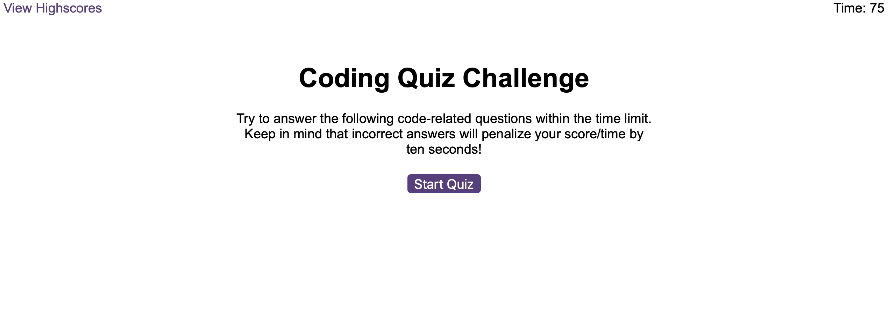

# HTML/JS Quiz

## Description
WHen the user presses start, the quiz starts with 10 multiple choice questions about HTML, CSS and JS. a 75 second timer starts and the user has this amount of time to answer the questions. Each wrong answer results in a 10 second penalty. The time remaining is the users final score, which can be submitted to the highscores leaderboard.

